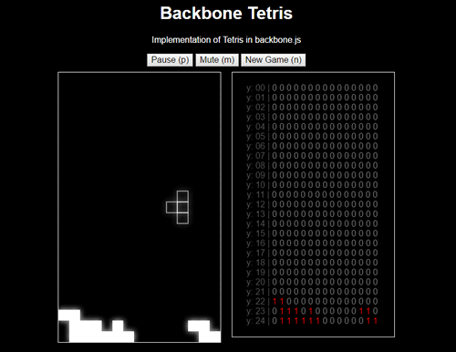

## Backbone.js Tetris

An implementation in [Backbone.js](http://backbonejs.org/) of Tetris, sans scoring and levels. 

For other Backbone experiments, see my basic [audio interface](https://github.com/unlikenesses/backbone.audioInterface), [drum machine](https://github.com/unlikenesses/backbone.beats), [audio yo-yo](https://github.com/unlikenesses/audio-yo-yo) and [maze solver](https://github.com/unlikenesses/backbone-maze).
